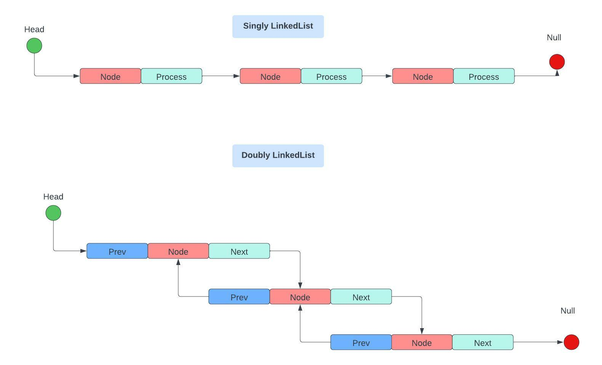

# JAVA COLLECTIONS FRAMEWORK

Collections are containers that group multiple items in a single unit.
They are dynamic containers, so we can add or remove data dynamically at runtime
Collections provide an architecture to store and manipulate a group of objects.
Using Java Collections Framework we can perform various operations: search, sort, insert, delete, …
In traditional data structures, we need to write API ourselves in order to perform these operations. 
Java Collection Framework will provide us with interfaces and classes in order to store and manipulate data.
___

## Java Collections Framework Hierarchy

Java Collections Framework Hierarchy is a set of APIs linked with the parent-child relationship and we can find them in `java.util` and `java.util.concurrent` packeges.


<p align="center"> Java Collections Framework Hierarchy Tree </p>

___

## Iterator and Iterable 
Iterator and Iterable 
Interfaces
classes implement Iterable => gains the ability to iterate over an object of that class using Iterator
The Collection interface along with all its subclasses implements both

### Iterator 
Provides the facility of iterating the elements only in a forward direction.
Implements Iterator Design Pattern

Methods: 
```java
public boolean hasNext() 	//=> true if there is next element 
public Object next()		//=> returns next element in the iteration	
public void remove()
```


example:
```java
ArrayList<String> names = new ArrayList(“John”, “Jane”, “Do”);
Iterator<String> itr = names.iterate();
// now all methods above are available to us (itr.next())
```

### Iterable
Root interface for all Collections classes

Represent a collection that can be traversed. 

Implementing an interface allows an object to make use of the `for-each` loop. It does it by internally calling the `iterator()` method on the object. 

<span style="color:green">Overriding</span> 

Any class that implements the Iterable interface needs to override the `iterator()` method provided by the Iterable interface. The **iterator() method returns an Iterator** which then can be used to iterate over an object of the class. 

Any class implementing the Iterator interface needs to override the `hasNext()` and `next()` methods provided by the **Iterator** interface. The `hasNext()` method returns true if the iteration has more elements and the `next()` method returns the next element in the iteration. 

<span style="color:green">Iteration state</span>

The Iterator remembers the current position in a collection and returns the next item in sequence if present. 
The Iterable, on the other hand, doesn’t maintain any such iteration state.

<span style="color:green">Contract</span>

Iterable produces a new instance of Iterator every time the iterator() method is called
This is because the Iterator maintains an iteration state.

Iterable doesn’t provide any method to modify its elements, nor can we modify them using the for-each loop.
Iterator allows removing elements from the underlying collection during the iteration with the remove() method.
___

## Collection 

The collection is implemented by all the classes in the collection framework and declares the methods every collection will contain.

**Methods (some of):**
1. `boolean add(Object obj)`
2. `boolean addAll(Object obj)`
3. `void clear()`


Class `java.util.Collections` consist of useful static methods that can be implemented in classes of Collections interface, such as `sort()`, `reverse()`, `swap()`
___

### List

Java List is an interface that extends Collection and contains an ordered collection in an index approach, and elements include duplicate values. 

Fundamental classes that implement List interface are:
1. ArrayList
2. LinkedList
3. Vector
   
**Common methods:**
```java
boolean add(Collection c)
void addFirst(Object o)
int size()
boolean contains(Object O)
Object[ ] to Array()
int lastIndexOf(Object o)
int IndexOf(Object o)
void add(int index, Object element)
void addLast(Object element)
Object clone()
boolean remove(Object o)
void clear()
void trimToSize()
```

___

### ArrayList
Elements can be dynamically added or removed from the list
Data is added in the indexed approach
Size is increased dynamically.
ArrayList class extends AbstractList class and implements the List interface.
Note that this implementation is not synchronized. If multiple threads access an ArrayList instance concurrently, and at least one of the threads modifies the list structurally, it must be synchronized externally.

**ArrayList source:**

```java
public class ArrayList<E> extends AbstractList<E> implements List<E>, RandomAccess, Clonable, Serializable
```

**Package:**
`java.utils.ArrayList`

________________________________________________________________________

<sapn style="color:yellow">NOTE: </span>

**Node** - the basic unit in a data structure, which contains data and one or more links to other nodes 

**Node Data Structures** - data structures of nodes that may occupy dispersed locations in memory 
________________________________________________________________________

________________________________________________________________________


### LinkedList

A sequence of links that contain items, each link contains a connection to another link

**Types:**

1. **Singly Linked List**
   
Each node in this list stores the data of the node and a pointer or reference to the next node in the list.
head- beginning of the linked list, points to the node
node - contains data and reference to the next node
….
the last node - contains data and reference to the null
Sometimes SIngly Linked List has reference to the first node (HEAD) and the last node (TAIL)


2. **Doubly Linked List**
Has two references: one to the next node and another to the previous node


<p align="center"> Singly and Doubly LinkedList </p>

**LinkedList source:**

```java
public class LinkedList<E> 
extends AbstractSequentialList<E>
implements List<E>, Deque<E>, Cloneable, java.io.Serializable
```
___

### Vector

Similar to arrays, elements can be accessed via an index.
Vector implements a dynamic array and is not limited to a specific size and is synchronized (thread-safe). We can say that the vector is a synchronized version of ArrayList.

**Vector VS LinkedList**

<span style="color:green">Vectors</span>

1. good 
   - random read accessinsertion
   - deletion in the back (takes amortized constant time)
2. bad
   - insertions and deletions in the front or any other position (linear time, as items have to be moved). 

Vectors are usually laid out contiguously in memory, so traversing one is efficient because the CPU memory cache gets used effectively.

<span style="color:green">LinkedList</span>

1. good
   - simple to implement (populas data structures)
    - inserting and deleting items in the front or back (constant time)
2. bad
   - nothing else is done fast 

For example, deleting an item at an arbitrary index in the middle of the list takes linear time O(N) because you must first find the node. On the other hand, once you have found a particular node you can delete it or insert a new item after it in constant time O(1), something you cannot do with a vector.


________________________________________________________________________

<sapn style="color:yellow">NOTE: </span>

**amortized constant time** - average time taken per operation, if you do many operations
________________________________________________________________________


___
 
### Queue


Queue in Java follows the **FIFO** approach and orders elements in a First In First Out manner. 

The first element is removed first and the last element is removed last.
PriorityQueue - will sort the data 

**Queue source:**
```java
public class PriorityQueue<E> 
extends AbstractQueue<E>
implements java.io.Serializable{}
PriorityQueue <Integer> q = new PriorityQueue<>();
```

___ 

### Set

The collection refers to a collection that cannot contain duplicate elements.

It will use a hashing technique by which we will have unique elements in Set.
It is used to model the mathematical set abstraction.
**Classes**
1. HashSet
2. LinkedHashSet
3. TreeSet

___
### HashSet

Java HashSet class creates a collection that uses a hash table for storage.
It will contain only unique elements.
It uses hashing mechanism (a hash function that generates a hash code element) to store elements.
Insertion order is not maintained.

**HashSet source:**
```java
public class HashSet<E> 
extends AbstractSet<E> 
implements Set<E>, Clonable, java.io.Serializable{}

HashSet<String> mySet = new HashSet<>();
```

___

### LinkedHashSet

Java LinkedHashSet class ia a Hash table and LinkedList implementation of the Set interface.
It will contain only unique elements.
It provides all options set operations and maintains insertion order.

**LinkedHashSet source:**
```java
public class LinkedHashSet<E> 
	extends HashSet<E>
	implements Set<E>, Clonable, java.io.Serializable{}
// because it extends HashSet it inherits all the same as HashSet like AbstractSet
LinkedHashSet<Integer> lhs = new LinkedHashSet<>();
```

___


### TreeSet

A sorted version of your Set.
TreeSet class implements the Set interface that uses a tree for storage.
All the data will be unique and sorted in ascending order. 

**TreeSet source:**
```java
public class TreeSet<E> 
extends AbstractSet<E>
implements NavigableSet<E>, Clonable, java.io.Serializable

TreeSet<String> ts = new TreeSet<>();
```
